# Handleiding PGM-site

Beste,
Hieronder vindt u de handleiding met betrekking tot de opbouw van de PGM-site. Hier kunt u vinden hoe u de site kan onderhouden en bugs uit het systeem kan halen. Deze handleiding werd gecreeërd om u te begeleiden binnen de navigatie doorheen de code van de website. Om deze handleiding ten volste te kunnen benutten zijn basis competenties binnen HTML, CSS en JS vereist.

---

## 1. Inhoudstabel.

* Hoe begin je eraan.
  * Installeer een code editor.
  * Clone the repository.
* Aanpassen en toevoegen van data.
  * Een case toevoegen en/of aanpassen.
  * Een post toevoegen en/of aanpassen.
  * Een student toevoegen en/of aanpassen.
  * Een docent toevoegen en/of aanpassen.
  * Foutmeldingen.
* Bewerken van pagina's.
  * De kleuren aanpassen.
  * De opmaak aanpassen.

---

## 2. Hoe begin je eraan.

### 2.1 Installeer een code editor.

Wanneer u wilt beginnen aan het bewerken van de code, heeft u een goede code editor nodig. Ik raad u aan om **vsc** te gebruiken, omdat dit ook de editor is die ikzelf gebruik. Deze kan u [hier downloaden](https://code.visualstudio.com/). Wanneer u dit heeft gedaan, bent u klaar om te starten.

### 2.2 Clone the repository.

Nadat uw code editor is geïnstalleerd, is deze klaar voor gebruik en kan u beginnen met het klonen van de repository vanuit **github**. De link naar de repository vindt u [**HIER**](https://github.com/pgmgent-1920-students/case1-pgm-website-baas-louimart3).
Volgende stappen moet u doorlopen:
* open de terminal op uw pc.
* navigeer naar de bestemming, waar u de repository wilt hebben.
  * optioneel maakt u op deze locatie een extra map aan, zodat u deze later eenvoudig kan raadplegen.  
* gebruik in uw terminal het commando '*git clone (url hier)*'.

Eens u de repository op uw computer hebt staan, kan u de code hiervan openen met vsc. Indien u de effectieve website wilt openen vanop uw computer (via een local host server) moet u via de terminal navigeren naar de *client* map en daar het commando **yarn install** uitvoeren. Dit commando zal alle nodige mappen en modules intalleren op uw pc om de server te kunnen opstarten. Als dit voltooid is, hoeft u alleen nog maar het commando **yarn start** uit te voeren  en de server start vanzelf op. Om de server te stoppen, druk je op de toetsen **shift + c**.

---

## 3. Aanpassen van data en toevoegen van data.

Het aanpassen van data of het toevoegen ervan is op zich niet zo heel moeilijk. In de volgende items wordt er stap voor stap uitgelegd, hoe je zaken kan aanpassen en toevoegen aan de code. Ook zal er uitleg verschaft worden, welke acties u dient te ondernemen bij foutmeldingen.

### 3.1 Een case toevoegen en/of aanpassen.

Een case toevoegen aan de site is zeer eenvoudig. U hoeft enkel maar de onderstaande stappen uit te voeren. Normaal gezien zou u dan geen foutmeldingen meer mogen ontvangen. Indien dit toch het geval zou zijn, keer dan terug naar paragraaf (*'Foutmeldingen.'*) om dit op te lossen.

1. Open de startfolder met vsc.
2. Navigeer vervolgens naar de folder **data** waar u dan alle mappen ziet die een json bevatten.
3. navigeer naar de map **cases** en open de file **index.json**
   
   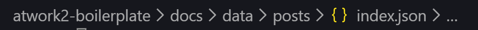

4. wanneer u het bestand opent, ziet u verschillende blokken met tekst.
5. Deze blokken  met tekst zijn opgedeeld in **key value pars**. (*De blauwe tekst is de **key** en de gele tekst is de **value**. Deze kleuren kunnen verschillen. Dit heeft te maken met de instelingen van uw vsc*)
Bij aanpassingen hiervan, dient u enkel de gele test (de value dus) aan te passen.

    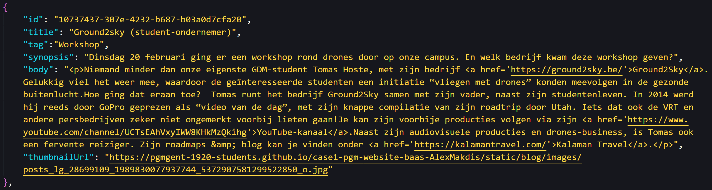

6.  Waneer u een case wilt toevoegen doet u dit door een bestaande case te kopieren en enkel de values aantepassen.
7.  voor 1 key is het niet al gelijk wat u er inzet. deze is de **id**. de value voor deze key moet gegenereerd worden en dat kan met de hulp van [**deze tool**](https://www.uuidgenerator.net/) .

### 3.2 Een post toevoegen en/of aanpassen.

Een post toevoegen aan de site is zeer eenvoudig. U hoeft enkel maar de onderstaande stappen uit te voeren. Normaal gezien zou u dan geen foutmeldingen meer mogen ontvangen. Indien dit toch het geval zou zijn, keer dan terug naar paragraaf (*'Foutmeldingen.'*) om dit op te lossen.

1. Open de startfolder met vsc.
2. Navigeer vervolgens naar de folder **data** waar u dan alle mappen ziet die een json bevatten.
3. navigeer naar de map **posts** en open de file **index.json**
   
   

4. wanneer u het bestand opent, ziet u verschillende blokken met tekst.
5. Deze blokken  met tekst zijn opgedeeld in **key value pars**. (*De blauwe tekst is de **key** en de gele tekst is de **value**. Deze kleuren kunnen verschillen. Dit heeft te maken met de instelingen van uw vsc*)
   
   

  Bij aanpassingen hiervan, dient u enkel de gele test (de value dus) aan te passen.
6.  Waneer u een case wilt toevoegen doet u dit door een bestaande post te kopieren en enkel de values aantepassen.
7.  voor 1 key is het niet al gelijk wat u er inzet. deze is de **id**. de value voor deze key moet gegenereerd worden en dat kan met de hulp van [**deze tool**](https://www.uuidgenerator.net/) .

### 3.3 Een student toevoegen en/of aanpassen.

Een student toevoegen aan de site is zeer eenvoudig. U hoeft enkel maar de onderstaande stappen uit te voeren. Normaal gezien zou u dan geen foutmeldingen meer mogen ontvangen. Indien dit toch het geval zou zijn, keer dan terug naar paragraaf (*'Foutmeldingen.'*) om dit op te lossen.

1. Open de startfolder met vsc.
2. Navigeer vervolgens naar de folder **data** waar u dan alle mappen ziet die een json bevatten.
3. navigeer naar de map **students** en open de file **index.json**
   
   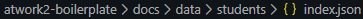

4. wanneer u het bestand opent, ziet u verschillende blokken met tekst.
5. Deze blokken  met tekst zijn opgedeeld in **key value pars**. (*De blauwe tekst is de **key** en de gele tekst is de **value**. Deze kleuren kunnen verschillen. Dit heeft te maken met de instelingen van uw vsc*)
   
   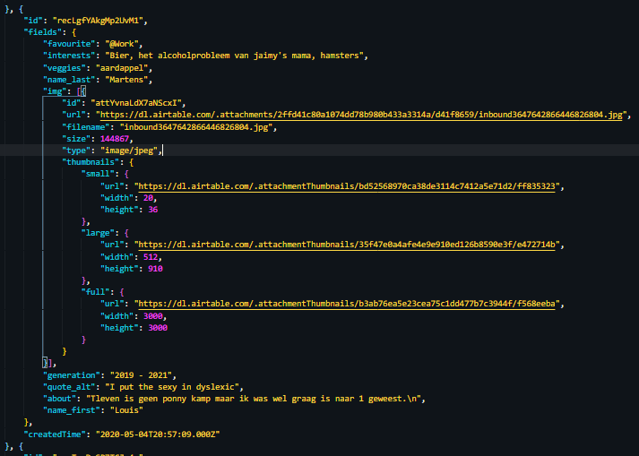

  Bij aanpassingen hiervan, dient u enkel de gele tekst (de value dus) aan te passen.
6.  Waneer u een student wilt toevoegen doet u dit door een bestaande student te kopieren en enkel de values aantepassen.
7.  voor 2 keys is het niet al gelijk wat u er inzet. deze zijn **id, createdTime**. De values voor deze keys  moet gegenereerd worden. Voor de **id** kan dit met de hulp van [**deze tool**](https://www.uuidgenerator.net/). En voor de **createdTime** gaat dit met [**deze tool**](https://currentmillis.com/).

### 3.4 Een docent toevoegen en/of aanpassen.

Een docent toevoegen aan de site is zeer eenvoudig. U hoeft enkel maar de onderstaande stappen uit te voeren. Normaal gezien zou u dan geen foutmeldingen meer mogen ontvangen. Indien dit toch het geval zou zijn, keer dan terug naar paragraaf (*'Foutmeldingen.'*) om dit op te lossen.

1. Open de startfolder met vsc.
2. Navigeer vervolgens naar de folder **data** waar u dan alle mappen ziet die een json bevatten.
3. navigeer naar de map **docenten** en open de file **index.json**
   
   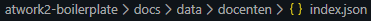

4. wanneer u het bestand opent, ziet u verschillende blokken met tekst.
5. Deze blokken  met tekst zijn opgedeeld in **key value pars**. (*De blauwe tekst is de **key** en de gele tekst is de **value**. Deze kleuren kunnen verschillen. Dit heeft te maken met de instelingen van uw vsc*)
   
   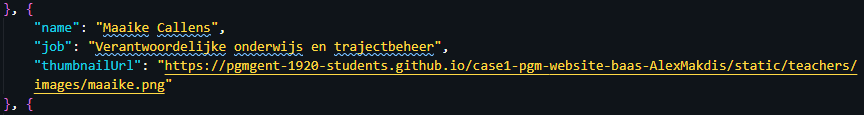

  Bij aanpassingen hiervan, dient u enkel de gele tekst (de value dus) aan te passen.
6.  Waneer u een docent wilt toevoegen doet u dit door een bestaande docent te kopieren en enkel de values aantepassen.

### 3.5 Foutmeldingen.

tijdens het toevoegen en/of aanpassen van de json kan het zijn dat het niet meteen werkt of dat u een foutmelding krijgt. Dit zijn vaak kleine zaken die snel en zonder al teveel problemen kunne opgelost worden. In de volgende punten kan je de meest voorkomende fouten terug vindenen en hoe je die meteen ook oplost.

* **syntaxis fouten :** deze komen het frequentst voor maar zijn dan ook weer de makkelijkst om optelossen. 
  
  * Geen **coma** op het einde van een key value pare.
  
    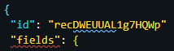
    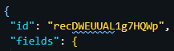

  * Geen **aanhalingstekens** rond de key en de value apart.
  
    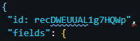
    

  * Geen dubbelepunt maar een **gelijkheidsteken** teken gebruikt.

    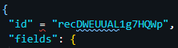
    

---

## 4. Bewerken van pagina's.

Als u een pagina of bepaalde componenten van de website wilt veranderen is dit mogelijk op een vrij eenvoudigemanier. In de volgende punten zal er voor iedere element meer in detail besproken worden hoe u deze zaken aanpast of toevoegt.

### 4.1 De kleuren aanpasen.

Als u de kleuren wilt aanpasen op de website gaat dit ook op een zeer gemakelijke manier. In de volgende punten word er stap voor stap uitgelecht hoe u dit moet doen 

1. navigeer naar de map '**_variables.scss**'.
   
    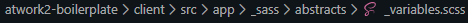

2. In dit bestand vindt u alle variable namen en eigenschapen terug van de kleuren die doorheen de website gebruikt worden.

    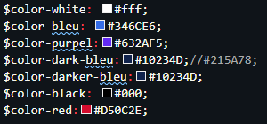

3. nu waneer u een kleur wilt aanpasen hoeft u enkel maar de eigenschap van de variable aantepassen. En het verandert over heel de website.

### 4.2 De opmaak aanpassen.

De opmaak van de site kan je ook helemaal aanpasen naar uw wil. voor de opmaak aantepassen gaat u wel basiccompetenties moeten hebben in scss. Maar in de volgende stappen gaat er uitgelecht worden hoe u bapaalde zaken gaat kunnen aanpassen zonder alteveel kennis van scss.

1. Navigeer naar het bestaand **_base.scss**.

    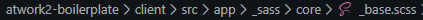

2. Waneer u het bestand geopend hebt gaat u verschillende bloken zien met tekst.
3. 